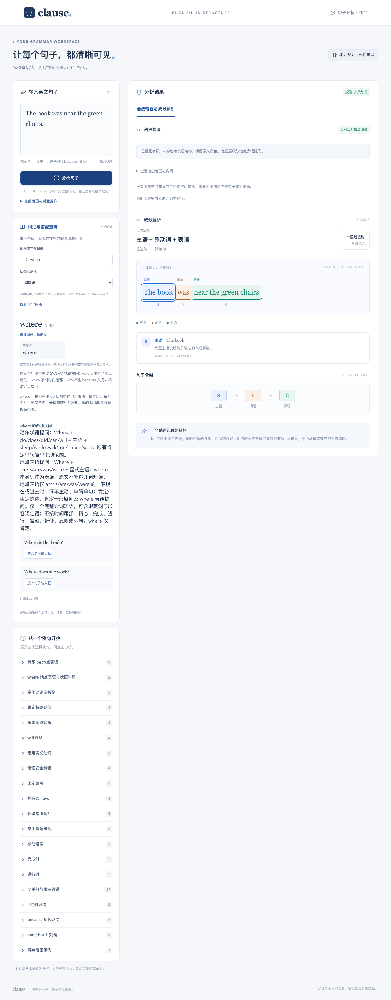
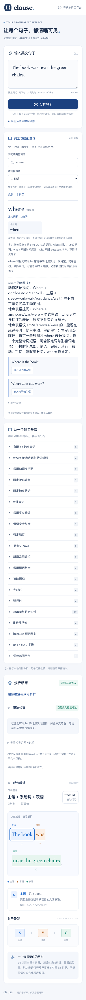

# 阶段 33F ✅ 联合交付

2026-10-04 完成。阶段 33A–33F 均已完成，阶段 33 ✅；当前规则 `0.23.1`、词典 `1.8.1`（格式 2），哈希 `d6112e8843db6228ff4228ad80c074469c14c39f8ee97684f01574ab8af85ac8`。下一步为阶段 34 的范围与人工答案冻结，尚未开放 SVO 地点附着。

本次补齐交付验证，没有新增解析权限或改写既有人工答案。33E 的原首次报告、来源归档、三条浏览器来源补充及 UI key 修复记录均保留。

## 数据库与回归

新增 [交付测试](../tests/stage33-delivery.test.mjs) 共 16 项，全量 **5797/5797**。在临时磁盘建立空 SQLite，执行现行迁移并从固定 1.8.1 重建 232 条词条，确定性导出与客户端快照逐字一致；隔离复制的分析器仅依赖该静态快照，逐字段复现全部 88 条独立语法答案。

未审核发布、过期审核哈希、篡改发布和冻结搭配更新均拒绝；新测试发布不影响原发布。1.0.0–1.7.0 文件与固定 Git 基线字节一致，1.8.0/1.8.1 与原冻结材料的校验继续由原测试覆盖。非空旧格式库原子拒绝、旧 fixture 与历史来源保护均完整回归。

1000/1001 UTF-16、共享 4000 预算及耗尽清空结果在原 8 个性能输入和新 6 个地点输入上验证；0/1/10 的受限预算均清空节点、分类和建议。原自然耗尽、两分句共享预算、同形词与多搭配断言继续保留。新输入及人工状态在第一次执行前固定，文件哈希见 [冻结记录](../tests/fixtures/stage33f-performance.sha256)。

## 浏览器与隐私

[开发记录](verification/stage33f-dev-browser.json) 和 [构建记录](verification/stage33f-built-browser.json) 各 34 项，1280×1000 / 390×1000 每个视口 17 项，共 **68 项**。覆盖地点表语和内部定语、where、纠错应用重分析、旧地点状语与 where 动作提问、can/perfect 系表、两分句内部查看及焦点返回、未开放组合拒绝、Ctrl/⌘+Enter、键盘成分选择、未知词原文定位、查询筛选与例句焦点、编辑即时失效、连续点击、长输入和刷新复位。截图已人工查看，无横向溢出、重复 key 或页面错误。

[真实 HMR](verification/stage33f-hmr-browser.json) **7 项**：已排队回调在编辑、查询例句和身份变更后被拒绝；真实文件 watcher 分别修改规则版本、词典版本及哈希，旧结果和建议失效，输入保留，页面未刷新。临时在分析器内注入受控失败，验证输入保留、无成分泄露及重试成功。所有文件在 finally 内恢复原字节，没有保留测试开关或生产兼容分支。

[无数据库运行](verification/stage33f-no-database-browser.json) **2 项**：把最终 dist 和启动所需文件复制到全新 `/tmp` 目录，不复制 `.lexicon` 或 SQLite，桌面／手机仍可分析地点表语。最终 worker 配置没有数据库绑定。三类浏览器检查合计 **77 项通过**。

[隐私记录](verification/stage33f-privacy.json)：静态资源加载后，在线及断网的分析、搜索、筛选和例句应用均 **0 个操作请求**。固定未知测试词未进入网络、控制台或开发／构建服务日志；localStorage、sessionStorage、IndexedDB 和 Cache Storage 均为空。刷新恢复默认句子、空查询和全部词性。实际用户输入仍仅在浏览器内存中处理。

浏览器脚本使用 webapp-testing 技能和本机已安装的 Playwright/Chromium；Python 环境无 Playwright，采用等价 Node API，无安装或下载。运行时路径可以用 `STAGE33_PLAYWRIGHT_MODULE` / `STAGE33_CHROMIUM` 覆盖。脚本只使用固定测试输入，临时故障和回调控制用于验收。

## 性能与工程检查

重新从 Git `0c5dbfb4940efd87ba87c7530f747168bcc1f003` 建立隔离的阶段 32 基线，使用相同本机 Node 运行原 8 个样例，各 100 次，再执行当前版本原 8 + 新 6 个样例。不是复用旧阶段耗时。见 [Node 基线](verification/stage33f-performance-baseline.json)、[当前](verification/stage33f-performance-current.json) 和 [对比](verification/stage33f-performance-comparison.json)。

- 旧样例中位耗时约为基线的 **1.00–1.05 倍**；新 6 个样例中位 **1.46–2.99ms**，p95 **1.58–3.32ms**。
- 快照从 213658 / gzip 16194 字节增至 226424 / gzip 16904 字节。
- 两个独立最终构建在同一 Chromium 中各执行 80 次原长输入交互；[浏览器对比](verification/stage33f-browser-performance.json) 中位比约 **0.88–1.04 倍**，均未观察到 50ms 长任务。当前两种服务与两种视口的长输入和完整流程也未观察到长任务。
- 构建 JS 总量从 782799 / gzip 191929 字节增至 810302 / gzip 196127 字节。该统计为全部 JS 文件独立 gzip 的总和，实际加载资源另逐项列出，不等于首屏传输量。

没有观察到明显退化。上述数据为本机验收，浏览器交互时间包含自动化、DOM 等待和渲染，不是跨设备性能保证。

`npm test`、`npx tsc --noEmit`、`npm run lint`、`npm run lexicon -- verify`、`npm run build`、两种 `git diff --check` 均通过。原 Proxy 提示与 Vinext 路由静态分类提示仍存在，无新阻断。测试、HMR 恢复和工程结果汇总于 [交付证据](verification/stage33f-delivery.json)。

范围与历史答案见 [33A](stage33-scope.md)、[33B](stage33b-protocol-lexicon.md)、[33C](stage33c-location-parser.md)、[33D](stage33d-ui-query.md)、[33E](stage33e-independent-acceptance.md)。本阶段不包含源码推送或公开部署。
